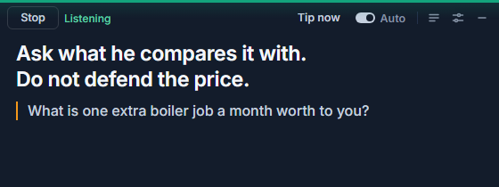

# Salescoach

**A live AI sales coach for Windows. It listens to your online sales calls and shows one short tip at a time on a small overlay that stays invisible when you share your screen.**

Open source (MIT), Electron + TypeScript. Bring your own key, or use your ChatGPT plan.

<!-- Add a screenshot at docs/screenshot.png, then remove the comment markers around the next line. -->
<!--  -->

## What it looks like

A narrow bar (about 560 px wide) sits at the top centre of your main screen, right under your webcam, so you keep looking at the person you are talking to. It is always on top and hidden from screen shares and recordings.

The bar has a status dot, a Start button, a Tip button, an "auto" toggle, a button for the live transcript, settings, and a hide button. Below it is the tip, in large text:

```
Expensive compared to what? Then ask what one extra job a month is worth to them.
? What does an average job bring you in?
```

Line one is what to say or do next, 15 words at most, preferably something you can say out loud as written. An optional second line starts with `?` and holds one question you can ask. That is all. You get one second of glancing time during a call, so the tips are written for one second.

English is the default. Dutch is also available: open settings and pick Nederlands under **Language / Taal**, the first choice in step 1. That one setting changes everything at once: the text of the app, the language of the tips and the language the coach listens for. Both windows switch right away, no restart needed.

## How it works

Two "ears" and one "brain".

```
  Your microphone ---------> Ears (live transcription) --+
                                                          |   ME:   ...
  Their voice (PC audio) --> Ears (live transcription) --+--> THEM: ...   kept in memory only
                                                          |
                    auto: after THEM finish a thought      |
                    hotkey: whenever you press it          |
                                                          v
  profile + call brief + playbook ----> Brain (fast text model, streaming)
                                                          |
                                                          v
                         Overlay: one short tip, or nothing (PASS)
```

- **Ears.** Your microphone is one live transcription stream (ME). The audio that plays on your PC, which is the other side of the call in Meet, Teams or Zoom, is a second stream (THEM). Because the two voices arrive on separate streams, there is no speaker diarization to get wrong.
- **Brain.** A fast text model gets the last few minutes of the conversation, your profile, your brief for this call and the sales playbook. It streams back one short tip.
- **Auto tips.** After THEM finish a thought, the brain decides whether there is anything worth saying. It only speaks up for an objection, a direct question, a buying signal or an important fact. Otherwise it answers `PASS` and you see nothing. Auto tips come at most once every 8 seconds.
- **Hotkeys.** `Ctrl+Shift+Space` always gives a tip, right now, and never answers PASS. `Ctrl+Shift+H` hides or shows the overlay. Both are defaults stored in the settings file, so you can change them.

### Why not a speech-to-speech model?

GPT-Live-1 and Gemini Live are built to talk back. A sales coach should never talk: any audio it produces would leak into your call. All we need is something that hears and something that thinks, and that is cheaper and easier to swap than one model that does both. If a better or cheaper transcriber or text model shows up next month, you pick it in settings and nothing else changes.

## Providers and costs

As of October 2026. Prices and free tiers change, so check the current pricing pages of Google and OpenAI before you rely on this.

| Role | Option | What you need | Cost |
|---|---|---|---|
| Ears | Gemini 3.5 Transcribe Live (default) | Free Gemini key | Free tier available. Sessions are capped at 10 minutes, so the app rolls over to a fresh session every 9 minutes with a short overlap. |
| Ears | OpenAI `gpt-live-transcribe` | OpenAI API key | Pay per use. The model has no built-in speech detection, so the app detects pauses itself. |
| Brain | Gemini Flash-Lite (default, `gemini-3.5-flash-lite`) | Gemini key | Free tier available, cheap beyond it. |
| Brain | OpenAI Responses API (default `gpt-5.4-mini`) | OpenAI API key | Pay per use. |
| Brain | Your ChatGPT Plus or Pro plan | Sign in with ChatGPT | Counts against your plan limits instead of API billing. The model list comes from your own account. |

Each call runs two transcription streams (you and them) for as long as you listen, and one short brain request per tip. Exact cost per call has not been measured yet, so look at your provider's usage page after a few real calls.

**Claude.** Anthropic's terms (February 2026) do not allow Claude subscriptions in third-party apps, so there is no "sign in with Claude". Claude API key support is on the roadmap.

## Quick start

You need:

- Windows 10 version 2004 or newer (Windows 11 is fine). The overlay is hidden from screen sharing with Windows' capture-exclusion flag, which does not exist before 2004. On older versions the overlay shows up as a black rectangle in shares.
- Node.js 22 or newer, and git.
- A microphone. A headset is strongly recommended (see Privacy and law).
- A free Gemini key: https://aistudio.google.com/apikey

```
git clone <repo-url> salescoach
cd salescoach
npm install
npm start
```

`npm start` builds the app and opens the overlay. Then:

1. Click the gear to open settings.
2. Paste your Gemini key (it is stored encrypted, see Security).
3. Check the language at the top of settings (Language / Taal). English is the default; pick Nederlands for Dutch calls.
4. Fill in your profile (next section) and, if you want, a brief for the call you are about to have.
5. Close settings and press Start. Press `Ctrl+Shift+Space` at any time for a tip.

To build a Windows installer: `npm run dist`. The installer lands in the `release/` folder. It is not code-signed, so Windows SmartScreen will warn you the first time.

### Troubleshooting

- **Nothing from THEM.** The app records what plays on your default output device. Check that the call audio comes out of that device, and that nothing else (music, notification sounds) is playing.
- **Nothing from ME.** In Windows Settings, Privacy and security, Microphone: allow desktop apps to use the microphone.
- **A hotkey does nothing.** Another program has taken it. The overlay shows a warning. Change the hotkey in the settings file.
- **ChatGPT brain says to choose a model.** After signing in, pick one of the models listed for your account.

## Make your profile in 2 minutes

The coach is only as good as what it knows about you. You do not have to type it all in.

1. In settings, open step 2 (Profile) and click "Copy profile prompt".
2. Paste it into ChatGPT or Claude. They already know you through their memory, and will ask at most five questions for what is missing.
3. Paste the answer back into the import box in settings and click "Import".
4. Read it, fix what is wrong, delete what you do not want the coach to use.

The profile has eight parts: who you are, your offer, your pricing, your ideal customer, cases you may mention, objections you hear and how you like to answer them, your hard rules and your tone of voice. The coach only uses prices, cases and promises that are in there. Where something is unknown, it is told to suggest "I will check and email it to you today" instead of inventing an answer.

To see what a filled-in profile looks like, paste [examples/profile-example.en.md](examples/profile-example.en.md) into the import box (it is fictional). For a per-call brief (who you are talking to, what you know, what you want to learn), see [examples/call-brief-example.en.md](examples/call-brief-example.en.md). Dutch versions of both are in the same folder (`*.nl.md`).

Keep your real profile out of git. The `profiles/` folder is git-ignored for exactly this reason.

## Sales knowledge

The coach follows a sales playbook that lives in [src/coach/playbook.md](src/coach/playbook.md). It is written in our own words and based on principles from Alex Hormozi, Chris Voss, Neil Rackham (SPIN Selling) and Keenan (Gap Selling): diagnose before you pitch, put a number on the pain, ask instead of tell, label feelings before you answer an objection, always leave with a next step and a date. No book text is included.

The playbook is plain markdown. Edit it if you disagree with something. You can also add your own book notes and sales rules to your private profile, so they stay on your machine.

## Privacy and law

- **Audio is never stored.** It is streamed to the transcription provider you chose (Google or OpenAI) and the app never writes it to disk.
- **Transcripts live in memory only,** for the length of the session. They are gone when you stop or close the app.
- **What the brain sees.** With every tip request, the last few minutes of transcript, your profile and your call brief go to the brain provider you chose.
- **Local files.** Settings, profile and call brief are plain files in the app's data folder under `%APPDATA%`. Your API keys and your ChatGPT login are encrypted with Windows DPAPI through Electron's `safeStorage`, which ties them to your Windows user account.
- **Free tier means your data may be used.** Google's free Gemini tier can use what you send to improve Google products. For client calls, use a paid key. Check the data terms of whichever provider you pick.
- **Check your local law, and tell the other person.** Rules about recording and transcribing calls differ per country, and in the EU the GDPR applies to what a third party processes for you. Say something like "I use an AI tool for notes during this call" at the start. This is not legal advice.
- **Use a headset.** If their voice comes out of your speakers, your microphone picks it up and it ends up in the transcript as something you said.

## Security notes

- API keys and tokens exist only in the main process. The renderer never sees them; the settings screen only learns whether a key is present.
- Renderer windows run sandboxed, with context isolation, no Node integration and a strict content security policy. Only microphone and display-capture permissions are granted.
- The overlay and the settings window are content-protected, so screen capture APIs skip them. This hides the window from software. It does not hide it from a phone camera pointed at your monitor. Record a test call and look at the result before your first real one.
- The ChatGPT sign-in uses a short-lived local callback server and stores its tokens encrypted.

## Evals

```
npm test        # unit tests
npm run eval    # runs scripted call situations through the real prompt and brain
```

`npm run eval` calls your brain provider, so it needs a key. It runs 30 English cases by default; `EVAL_LANG=nl` runs the Dutch set. What the evals check and how to add your own cases is described in [evals/README.md](evals/README.md).

## Roadmap

- Practice mode: a realistic AI prospect that talks back (this is where a speech-to-speech model such as GPT-Live-1 does fit), so you can rehearse objections.
- Post-call summary with next steps.
- Claude API key as a brain.
- More interface languages.
- macOS.
- More providers.

## License and credits

MIT, see [LICENSE](LICENSE).

"Sign in with ChatGPT" is implemented from OpenAI's public protocol documentation. No code from OpenAI's noncommercial devkit is included. Salescoach is not affiliated with OpenAI, Google or Anthropic.

Built by Rogier Helvensteijn, Reflow Automations.

---

## Nederlands

**Salescoach luistert mee met je online verkoopgesprekken (Meet, Teams, Zoom) en toont één korte tip tegelijk op een klein overlay-venster. Dat venster is onzichtbaar als je je scherm deelt.**

- **Zo werkt het.** Twee "oren": je microfoon (jij) en het geluid van je pc (de ander) worden apart live uitgeschreven, dus je hebt geen sprekerherkenning nodig. Eén "brein": een snel tekstmodel dat één korte tip schrijft. Automatische tips komen alleen na een bezwaar, een vraag of een koopsignaal. Anders blijft het stil. `Ctrl+Shift+Space` geeft altijd direct een tip, `Ctrl+Shift+H` verbergt het venster.
- **Wat je nodig hebt.** Windows 10 versie 2004 of nieuwer, Node.js 22 of nieuwer, een headset en een gratis Gemini-key (aistudio.google.com/apikey). Of je ChatGPT-abonnement via "Sign in with ChatGPT". Claude-abonnementen mogen volgens Anthropic niet in apps van derden, een Claude API-key staat op de roadmap.
- **Taal.** De app staat standaard in het Engels. Nederlands kies je in de instellingen, bovenaan stap 1 bij **Language / Taal**. Die ene keuze bepaalt de tekst van de app, de taal van de tips en de taal waarin de coach meeluistert. Beide vensters schakelen meteen om.
- **Starten.** `git clone <repo-url> salescoach`, dan `npm install` en `npm start`. Open de instellingen (tandwiel), kies Nederlands bij Language / Taal, plak je key, vul je profiel in en druk op Start. Een installer maken kan met `npm run dist`, die komt in de map `release/`.
- **Profiel in 2 minuten.** Kopieer de profielprompt uit de instellingen, plak hem in ChatGPT of Claude (die kennen je al), plak het antwoord terug in het importvak en klik op Importeer. Een voorbeeld staat in [examples/profile-example.nl.md](examples/profile-example.nl.md), een voorbeeld van een gespreksbrief in [examples/call-brief-example.nl.md](examples/call-brief-example.nl.md).
- **Privacy en wet.** Audio wordt nooit opgeslagen, transcripts blijven alleen in het geheugen. Keys staan versleuteld (Windows DPAPI). De gratis Gemini-laag mag data gebruiken om Google-producten te verbeteren, gebruik voor klantgesprekken dus een betaalde key. Check de wet in jouw land, bekijk of je een verwerkersovereenkomst nodig hebt, en zeg aan het begin van het gesprek dat je een AI-tool gebruikt voor notities. Draag een headset, anders hoort je microfoon de ander ook en komt die tekst bij jou terecht.
- **Licentie.** MIT. Niet verbonden aan OpenAI, Google of Anthropic. Gebouwd door Rogier Helvensteijn, Reflow Automations.
